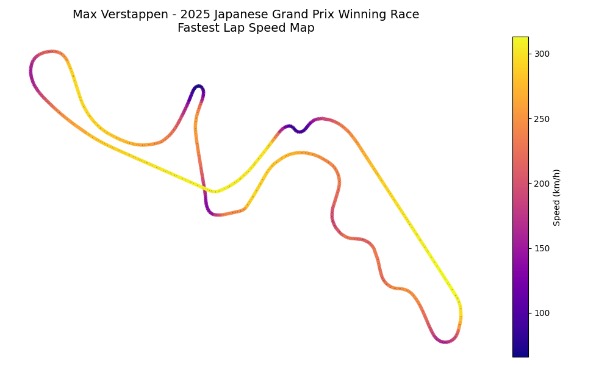

# F1 Fastest Lap Speed Map

Simple Python script that uses FastF1 telemetry to plot Max Verstappen's fastest lap speed map for the 2025 Japanese Grand Prix.

The track is drawn from telemetry coordinates and colored by car speed over the lap.

## Example Output



## Requirements

- Python 3.9+
- Dependencies listed in `requirements.txt`

## Setup

```bash
pip install -r requirements.txt
```

## Run

```bash
python F1.py
```

## Customize

The current script is set up for Max Verstappen (`VER`) in the 2025 Japanese Grand Prix race.

To customize it, edit these variables in [F1.py](/Users/piotrobiegly/Downloads/F1/F1.py):

- `year` for the season
- `race` for the Grand Prix name
- `session_type` for the session, such as `R` (race), `Q` (qualifying), or `FP1`
- `driver` for the three-letter driver code, such as `VER`, `NOR`, or `LEC`

## Output

The script:

- downloads and caches FastF1 session data in a local `cache/` directory
- loads the 2025 Japanese Grand Prix race session
- selects Max Verstappen's fastest lap telemetry
- opens a Matplotlib window with a speed-colored track map
